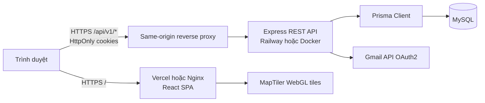
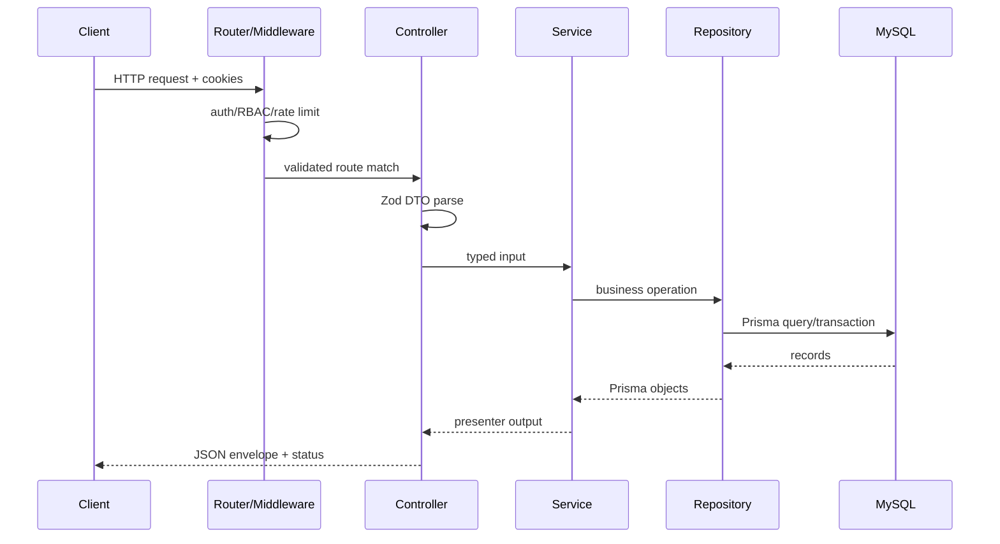

# Kiến trúc hệ thống

## 1. Tổng quan

RoomFinder là web application ba tầng:

- Frontend SPA: React 18, TypeScript, Vite, Tailwind CSS và React Router.
- Backend REST API: Express 5, TypeScript, feature-based MVC, Zod DTO, JWT cookie và RBAC.
- Data layer: MySQL 8.4, Prisma Client và bộ seed JSON production.



Ở production, Vercel phục vụ SPA và rewrite `/api/*` sang Railway. Ở Docker local, Nginx phục vụ SPA và proxy `/api/*` sang container backend. Hai môi trường đều giữ frontend và API trên cùng origin nhìn từ trình duyệt, giúp cookie `HttpOnly` hoạt động mà frontend không phải lưu token.

## 2. Cấu trúc repository

```text
room-finder/
├── backend/
│   ├── prisma/                 # Runtime schema và seed
│   └── src/
│       ├── features/           # Feature modules
│       ├── shared/             # config, DB, error, mail
│       ├── app.ts              # Express composition root
│       └── server.ts           # HTTP server + background jobs
├── frontend/
│   └── src/
│       ├── components/         # Shared UI theo layout/map/room/search
│       ├── context/            # Auth/Search/Wishlist state
│       ├── pages/              # Route-level pages
│       ├── services/api.ts     # REST client và adapters
│       └── types/              # UI domain types
├── database/production/json/   # Seed dataset dùng bởi runtime
├── docs/                       # Tài liệu bàn giao
└── docker-compose.yml          # MySQL + backend + frontend
```

## 3. Backend: feature-based MVC

Backend được chia theo feature thay vì gom toàn bộ controller/model/service theo tầng toàn cục:

```text
features/<feature>/
├── *.routes.ts       # Khai báo endpoint và middleware
├── *.controller.ts   # HTTP input/output, status code
├── *.dto.ts          # Zod validation và inferred input types
├── *.service.ts      # Business rules, transaction orchestration
├── *.repository.ts   # Prisma queries
└── *.presenter.ts    # Chuyển Prisma entity thành REST response khi cần
```

Các feature hiện có:

| Feature | Trách nhiệm |
| --- | --- |
| `auth` | đăng ký, OTP, login, refresh, logout, JWT sessions |
| `users` | cập nhật profile người dùng |
| `rooms` | public listing, filter, pagination, detail, availability |
| `hosts` | onboarding Host, listing CRUD, dashboard, reservation, calendar |
| `bookings` | quote, booking transaction, trip, cancellation, email outbox |
| `reviews` | review của Traveler và reply của Host |
| `wishlists` | lưu/bỏ lưu listing |

Luồng request điển hình:



`app.ts` là composition root: CORS, JSON parser, cookie parser, health endpoint, feature routers, 404 và error handler. `server.ts` mở HTTP listener, chạy email outbox worker và job đánh dấu booking quá hạn thành `COMPLETED` mỗi giờ.

## 4. Frontend architecture

`App.tsx` thiết lập provider và router. Các route page được `React.lazy` để code-split; MapTiler chỉ được tải khi trang sử dụng bản đồ được mở.

Provider tree:

```text
AuthProvider
└── WishlistProvider
    └── SearchProvider
        └── BrowserRouter
            └── Suspense + Routes
```

- `AuthContext`: tải `/auth/me`, giữ user và các action login/logout/onboarding.
- `WishlistContext`: tải wishlist một lần theo user và optimistic toggle.
- `SearchContext`: trạng thái điểm đến, ngày, số khách, filter và search modal.
- `services/api.ts`: luôn gửi `credentials: include`, tự refresh một lần khi gặp 401 và chuyển camelCase API sang snake_case UI types.

## 5. Luồng nghiệp vụ chính

### Đăng ký và xác thực email

1. Client gọi `POST /auth/register`.
2. Backend tạo user trạng thái `PENDING`, hash password bằng bcrypt cost 12.
3. OTP 6 số được hash và lưu trong `otp_tokens`, sau đó gửi qua Gmail API.
4. Client gọi `POST /auth/verify-email`.
5. Backend activate user, tạo DB session, set access/refresh cookie.

### Booking và email xác nhận

1. Client lấy quote và gửi booking cùng `Idempotency-Key`.
2. Service kiểm tra listing active, sức chứa và xung đột lịch.
3. Trong một Prisma transaction: tạo booking, block calendar, tạo email outbox job.
4. Worker lấy job, gửi Gmail và retry tối đa 5 lần theo backoff.

### Host tạo listing

1. User onboard thành Host, role được đổi thành `HOST` và token được cấp lại.
2. Form 7 bước gửi `POST /host/listings`.
3. UI khóa double-submit và hiển thị loading overlay.
4. Backend rate-limit một create thành công/10 giây/Host.
5. Listing, images và amenities được nested-create qua Prisma.

## 6. Quy ước HTTP và lỗi

- Base path: `/api/v1`.
- Success phổ biến: `{ "data": ... }`.
- Danh sách phân trang: `{ "data": [...], "meta": { "page", "limit", "total", "totalPages" } }`.
- Error: `{ "error": { "code": "...", "message": "...", "details"?: ... } }`.
- Zod validation được error handler chuyển thành HTTP 422.
- Auth/RBAC dùng HTTP 401/403; conflict dùng 409; business validation thường dùng 422.

## 7. Những quyết định và technical debt cần biết

- Runtime schema là MySQL; schema/SQL PostgreSQL trong `database/production` chỉ là legacy reference.
- Không có migration history; deploy hiện chạy `prisma db push`. Production nghiêm túc nên chuyển sang Prisma Migrate.
- MapTiler API key hiện hard-code trong component và cần chuyển sang `VITE_MAPTILER_API_KEY`.
- Rate-limit create listing dùng memory store, chỉ nhất quán trong một backend replica; khi scale ngang cần Redis store.
- Frontend route protection chủ yếu dựa vào API trả 401/403; backend mới là security boundary thực tế.
