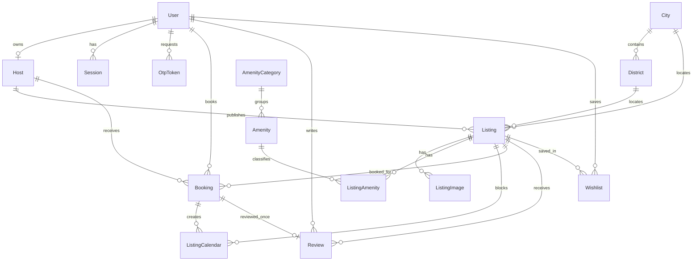

# Database schema và dữ liệu

## 1. Runtime database

- Engine: MySQL 8.4.
- ORM: Prisma 6.19.3.
- Schema chuẩn: `backend/prisma/schema.prisma`.
- Connection: biến môi trường `DATABASE_URL`.
- Naming: field TypeScript dùng camelCase; `@map`/`@@map` ánh xạ sang snake_case ở MySQL.

Không dùng `database/production/prisma/schema.prisma` để generate client: file đó là thiết kế PostgreSQL cũ và khác runtime về provider, role, auth/session/outbox.

## 2. ERD runtime



## 3. Enums

| Enum | Giá trị | Ý nghĩa |
| --- | --- | --- |
| `Role` | `TRAVELER`, `HOST` | Role runtime duy nhất; Guest là trạng thái chưa login |
| `UserStatus` | `PENDING`, `ACTIVE`, `SUSPENDED` | Vòng đời account |
| `ListingStatus` | `DRAFT`, `ACTIVE`, `INACTIVE` | Chỉ `ACTIVE` xuất hiện trong public search |
| `BookingStatus` | `UPCOMING`, `COMPLETED`, `CANCELLED` | Trạng thái chuyến đi |
| `PaymentStatus` | `PENDING`, `PAID`, `REFUNDED`, `FAILED` | Trạng thái thanh toán lưu trong booking |
| `OtpPurpose` | `EMAIL_VERIFICATION`, `PASSWORD_RESET` | Phân tách OTP theo mục đích |
| `EmailOutboxType` | `BOOKING_CONFIRMATION` | Loại email async hiện có |
| `EmailOutboxStatus` | `PENDING`, `PROCESSING`, `SENT`, `FAILED` | Vòng đời outbox job |

## 4. Bảng dữ liệu

### Identity và authorization

| Model | Trường/ràng buộc quan trọng |
| --- | --- |
| `User` | UUID PK; `username` và `email` unique; bcrypt `passwordHash`; role/status; `emailVerifiedAt`; quan hệ 1-0..1 với Host |
| `Host` | UUID PK; `userId` unique FK cascade; profile, superhost, response metrics và aggregate counters |
| `Session` | token refresh hash unique, expiry và `revokedAt`; không lưu refresh token thô |
| `OtpToken` | purpose, bcrypt code hash, expiry, consumed timestamp, attempt count; index `(userId,purpose,expiresAt)` |

### Discovery và listing

| Model | Trường/ràng buộc quan trọng |
| --- | --- |
| `City` | ID do dataset cung cấp, slug unique, tọa độ và ảnh |
| `District` | FK City; unique `(cityId,name)` |
| `Listing` | Host FK; vị trí, giá, capacity, rating, cover, policy, status; index `(city,status,pricePerNight)` và `hostId` |
| `ListingImage` | FK Listing cascade; `displayOrder`, `isCover`; index `(listingId,displayOrder)` |
| `AmenityCategory` | Nhóm tiện nghi và thứ tự hiển thị |
| `Amenity` | `code` unique, optional category |
| `ListingAmenity` | PK ghép `(listingId,amenityName)`; giữ được tên tiện nghi dù không có master Amenity |

### Booking, calendar và social

| Model | Trường/ràng buộc quan trọng |
| --- | --- |
| `Booking` | `bookingCode` unique; `idempotencyKey` unique; snapshot guest/listing/host/price; indexes theo user, host và date range |
| `ListingCalendar` | date range block; optional Booking FK; Host block có `bookingId = null` |
| `Review` | `bookingId` unique nên mỗi booking tối đa một review; optional host reply |
| `Wishlist` | unique `(userId,listingId)` ngăn duplicate |
| `EmailOutbox` | `dedupeKey` unique; attempts/availableAt/lockedAt; index `(status,availableAt)` |

## 5. Quan hệ xóa

- Xóa User cascade sessions, OTP, bookings và wishlists; Review giữ được bằng `userId` nullable/SetNull.
- Xóa Host cascade listings và bookings liên quan.
- Xóa Listing cascade images, amenities, calendar, bookings, reviews và wishlists.
- Xóa City/District không xóa listing; FK của listing được SetNull.
- Thao tác “xóa listing” qua API hiện là soft archive: đổi status sang `INACTIVE`, không gọi SQL delete.

## 6. Dữ liệu seed production

Nguồn import runtime là `database/production/json/`:

| Dataset | Số lượng hiện tại |
| --- | ---: |
| Listings | 473 |
| Hà Nội | 199 |
| Đà Nẵng | 167 |
| Hồ Chí Minh | 107 |
| Hosts | 18 |
| Users | 26 |
| Bookings | 15 |
| Reviews | 1.899 |
| Wishlists | 8 |
| Cities | 3 |

`backend/prisma/seed.ts` import users → hosts → cities/districts → listings cùng images/amenities/calendar → bookings → reviews → wishlists.

Seed có tính chất bootstrap, không phải migration:

- Nếu `user.count() > 0`, seed không import lại dữ liệu; chỉ sửa password hash demo cũ nếu cần.
- Nếu DB rỗng, seed xóa các bảng mục tiêu với foreign key checks tạm tắt rồi import toàn bộ.
- `SEED_DATA_DIR` cho phép đổi đường dẫn dataset; Docker dùng `/app/database/production/json`.
- Seed tạo calendar block từ `booked_dates`; booking `UPCOMING` cũng tạo calendar entry gắn booking.

## 7. Data contract và presenter

Prisma trả camelCase theo schema. Presenter backend tạo public contract, ví dụ Listing gồm:

- scalar: `id`, `name`, `roomType`, `city`, `district`, `address`, tọa độ và giá;
- `specs`: `guests`, `bedrooms`, `beds`, `baths`;
- arrays: `images`, `amenities`, `reviews`, `bookedDates`;
- `host` và cancellation policy ở detail response.

List endpoint chỉ lấy tối đa 5 ảnh/listing để giảm payload; detail endpoint giữ toàn bộ gallery. Frontend adapter trong `services/api.ts` đổi các response này sang UI type snake_case.

## 8. Validation dữ liệu

Chạy bộ validation nguồn JSON/SQL legacy:

```bash
python3 database/production/scripts/validate_production.py
```

Kiểm tra runtime schema và client:

```bash
cd backend
npx prisma validate
npm run prisma:generate
```

Để xem DB trong môi trường development:

```bash
cd backend
npx prisma studio
```

## 9. Lưu ý khi thay đổi schema

Hiện Docker entrypoint dùng `prisma db push --skip-generate`. Quy trình an toàn hơn cho production là tạo migration được review:

```bash
cd backend
npx prisma migrate dev --name <change_name>
npx prisma migrate deploy
```

Không chỉnh đồng thời schema MySQL runtime và schema PostgreSQL legacy rồi giả định chúng tự đồng bộ.

