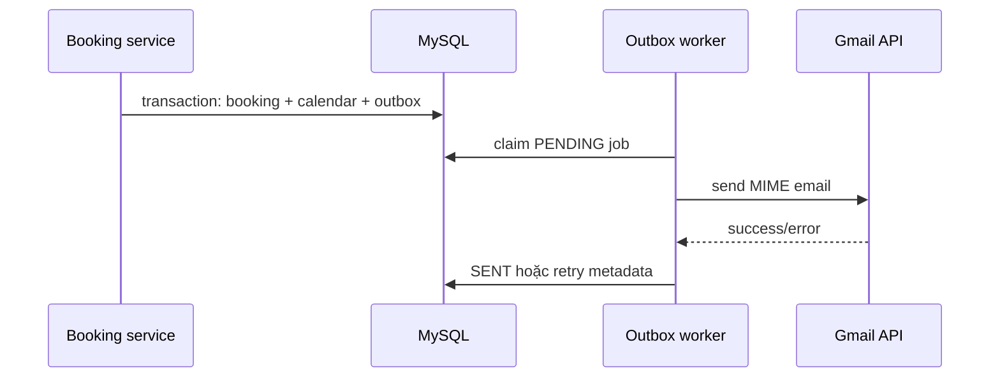

# Dịch vụ bên thứ ba

## 1. Gmail API

### Mục đích

Backend dùng Gmail API để gửi ba loại transactional email:

- OTP xác thực email.
- OTP quên mật khẩu.
- Xác nhận booking thành công.

Không dùng SMTP password. `GmailMailProvider` dùng OAuth2 refresh token và gọi `gmail.users.messages.send` với `userId: "me"`.

### Biến môi trường

```dotenv
GMAIL_CLIENT_ID=<OAuth 2.0 client ID>
GMAIL_CLIENT_SECRET=<OAuth 2.0 client secret>
GMAIL_REFRESH_TOKEN=<offline refresh token của sender>
GMAIL_SENDER=<địa chỉ Gmail đã authorize>
EMAIL_WORKER_ENABLED=true
```

`GMAIL_SENDER` phải là mailbox đã cấp quyền cho refresh token. Không điền email người nhận vào biến này; recipient được truyền theo từng request/booking.

### Thiết lập Google Cloud

1. Tạo/chọn Google Cloud project.
2. Enable **Gmail API**.
3. Cấu hình OAuth consent screen.
4. Nếu app ở trạng thái Testing, thêm địa chỉ Gmail sender vào **Test users**; lỗi `403 access_denied` thường do thiếu bước này.
5. Tạo OAuth 2.0 Client ID.
6. Dùng OAuth 2.0 Playground để tạo refresh token:
   - thêm redirect URI `https://developers.google.com/oauthplayground` vào client;
   - trong Playground settings bật “Use your own OAuth credentials”;
   - nhập client ID/secret;
   - authorize scope gửi mail Gmail (`gmail.send`);
   - exchange authorization code để lấy refresh token.
7. Lưu bốn biến vào `.env` local và Railway Variables, không commit.

Backend runtime **không cần callback URL riêng**. Redirect/callback chỉ dùng trong bước cấp refresh token qua OAuth Playground; sau đó backend sử dụng refresh token server-to-server.

### Luồng gửi OTP

OTP được render thành text + HTML MIME, gửi đồng bộ trong auth request. Nếu Gmail lỗi, service chuyển lỗi thành `503 EMAIL_DELIVERY_FAILED` (riêng forgot-password che giấu lỗi để chống email enumeration).

### Luồng booking outbox



Worker chạy mỗi 2 giây, mỗi batch tối đa 10 job. Job `PROCESSING` quá 10 phút được phục hồi. Retry tối đa 5 lần với delay 1 phút, 5 phút, 15 phút, 1 giờ và 6 giờ. `dedupeKey` unique tránh gửi cùng booking hai lần.

### Troubleshooting Gmail

| Triệu chứng | Kiểm tra |
| --- | --- |
| `403 access_denied` | Consent screen ở Testing nhưng sender chưa nằm trong Test users |
| `invalid_grant` | Refresh token revoked/expired, client sai, hoặc password/security change |
| `Gmail OAuth2 is not configured` | Thiếu một trong bốn `GMAIL_*` variables |
| OTP API trả 503 | Gmail send thất bại; kiểm tra Railway logs và OAuth credentials |
| Booking mail không tới | Kiểm tra `email_outbox.status`, attempts, lastError và worker enabled |

Refresh token ở app Testing có thể chịu giới hạn/vòng đời theo chính sách Google. Cho môi trường ổn định cần hoàn tất consent configuration thích hợp và giới hạn scope tối thiểu.

## 2. MapTiler

### Mục đích

Frontend dùng `@maptiler/sdk` để render vector map, navigation controls và HTML markers. Tile/style request đi trực tiếp từ browser tới MapTiler; backend không proxy bản đồ.

### Component integration

`GoogleMapEmbed`:

- dùng `MapStyle.STREETS`;
- center mặc định theo ba thành phố;
- detail zoom 15 vào tọa độ listing;
- search dùng `fitBounds` trên listing hiện tại;
- marker có pill giá/dot và hover preview;
- click marker điều hướng room detail;
- cleanup listeners, markers và map instance khi unmount.

### API key hiện tại

Key hiện đang được hard-code trong `frontend/src/components/map/GoogleMapEmbed.tsx`. Map browser key vốn xuất hiện ở client bundle, nhưng vẫn phải được giới hạn domain/quota tại MapTiler dashboard.

Khuyến nghị chuyển code sang:

```ts
const MAPTILER_API_KEY = import.meta.env.VITE_MAPTILER_API_KEY;
```

Và cấu hình:

```dotenv
VITE_MAPTILER_API_KEY=<public browser key>
```

Sau khi chuyển, thêm variable vào Vercel và Docker build args nếu cần. Restrict allowed origins ít nhất:

- `https://room-finder-usth.vercel.app`
- domain preview cần thiết;
- `http://localhost:5173` và/hoặc `http://localhost:8088` cho development.

### Tọa độ và marker

Listing longitude/latitude lấy từ API dưới dạng number. MapTiler nhận thứ tự `[longitude, latitude]`, không phải `[latitude, longitude]`. Marker root phải là absolute-positioned và không được đặt `position: relative`, nếu không transform của MapLibre có thể làm marker trôi khi zoom.

### Troubleshooting MapTiler

| Triệu chứng | Kiểm tra |
| --- | --- |
| Map trắng/401 | API key, origin restriction, quota, network console |
| Marker sai quốc gia | Thứ tự longitude/latitude và data source |
| Marker trôi khi zoom | CSS `.custom-maptiler-marker`, position và transform |
| Map sai kích thước | Container phải có height; gọi `map.resize()` sau layout |
| Map bundle làm Landing chậm | Giữ component trong lazy route chunk, không import ở app shell |

## 3. CDN ảnh bên ngoài

Dataset dùng URL ảnh từ CDN ngoài (đặc biệt muscache/Airbnb và Unsplash). `utils/image.ts` thêm width/crop parameters khi provider hỗ trợ. Rủi ro bàn giao:

- URL ngoài có thể hết hạn hoặc chặn hotlink.
- Cần CSP/allowed image domains nếu chuyển sang framework tối ưu ảnh khác.
- Không tải toàn gallery ở list view; backend chỉ trả tối đa 5 ảnh và card chỉ render ảnh active.

