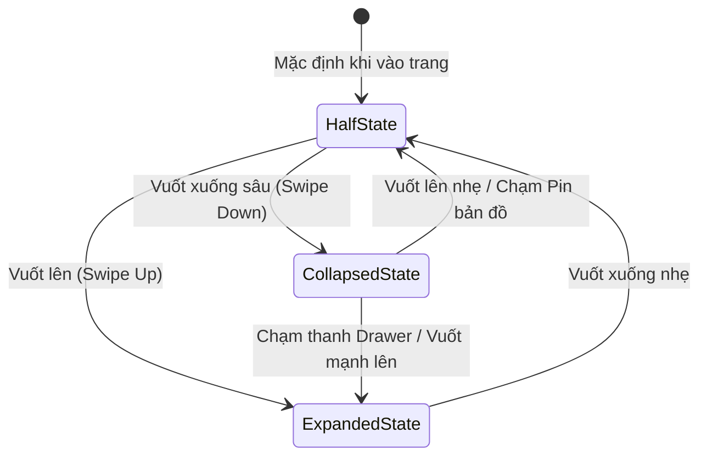

# Wireframe & Concept: Giao diện Mobile Phòng & Bản đồ dạng Drawer (Airbnb Pattern)

> Tài liệu đặc tả Wireframe và Interaction Flow cho màn hình danh sách phòng `/rooms` trên thiết bị di động (Mobile Web/App), được phân tích và thiết kế dựa trên ảnh mẫu thực tế:
> `frontend/concept/mobile/orca-paste-1790447598470-86f666bd-2f7a-411f-b5fb-47755a754889.png`

---

## 1. Tổng quan Kiến trúc Giao diện (Architectural Overview)

Trên ứng dụng di động của Airbnb, màn hình tìm kiếm phòng không dùng cách chia 2 cột dọc (Desktop split-view) hay nút chuyển đổi rời rạc, mà sử dụng mô hình **Dual-Layer Architecture** kết hợp **Floating Interactive Bottom Drawer (Bottom Sheet đa tầng)**:

```
┌────────────────────────────────────────────────────────┐
│ Layer 3: Sticky Top Search Bar & Filter Chips (z-40)   │
├────────────────────────────────────────────────────────┤
│ Layer 1 (Nền): Interactive Full-Screen Map (z-10)      │
│  - Tọa độ địa lý, huy hiệu giá động (Price Badges)     │
├────────────────────────────────────────────────────────┤
│ Layer 2 (Nổi): Floating Bottom Drawer / Sheet (z-20)   │
│  - 3 nấc kéo (Snap Points): Collapsed / Half / Expanded│
│  - Thẻ phòng cuộn mượt (Card slider + thông tin)       │
└────────────────────────────────────────────────────────┘
```

---

## 2. Chi tiết 3 Trạng thái của Drawer (Snap Points)

Bottom Drawer có **3 điểm dừng (Snap Points)** phản hồi theo cử chỉ vuốt ngón tay (Drag / Swipe Gesture):



1. **Trạng thái Mặc định (Half / Split View - 45% - 50% màn hình)**:
   - Nửa trên: Bản đồ hiển thị các huy hiệu giá (`960.000 đ`, `936.000 đ`...).
   - Nửa dưới: Thẻ phòng đầu tiên đang được chọn/xem. Người dùng vừa thấy không gian xung quanh vừa xem thông tin phòng.
2. **Trạng thái Mở rộng (Expanded Full View - 88% - 90% màn hình)**:
   - Drawer được kéo lên gần chạm thanh filter, biến thành danh sách cuộn dọc toàn màn hình để duyệt nhiều phòng liên tục.
3. **Trạng thái Thu gọn (Collapsed / Map Focus - 70px - 80px đáy)**:
   - Drawer thu nhỏ xuống đáy, chỉ để lộ thanh gạt và số lượng phòng ("Hơn 450 chỗ ở"). Nhường toàn bộ màn hình để khám phá bản đồ.

---

## 3. Bản vẽ Wireframe Chi tiết (ASCII Wireframe)

### 3.1. Trạng thái Mặc định: Half-Screen Drawer (Mẫu thực tế từ ảnh screenshot)

```
┌──────────────────────────────────────────────┐
│  [<-]  (     Chỗ ở tại Đà Nẵng     )   [⁝=]  │ <- Header nổi (z-40)
│        (  cuối tuần bất kỳ · Thêm khách )     │
├──────────────────────────────────────────────┤
│ [Wi-fi]  [TV]  [Được khách thích]  [Bể bơi] >│ <- Filter Chips cuộn ngang
├──────────────────────────────────────────────┤
│                                              │
│                   [QL14B]                    │
│           (📍 Đà Nẵng)  [960.000 đ]          │
│                      [936.000 đ]             │ <- Lớp Bản đồ (Map Layer)
│                       =========              │
│       [QL1A]          (Pin Focus)            │
│                                              │
│                                              │
│                                [950.000 đ]   │
│                                              │
├──────────────────────────────────────────────┤
│               ═════════════                  │ <- Drag Handle (Thanh kéo)
│       🏷️  Giá đã bao gồm mọi khoản phí       │ <- Giá minh bạch notice
│ ┌──────────────────────────────────────────┐ │
│ │ [Chủ nhà siêu cấp]                   [♡] │ │
│ │                                          │ │
│ │                                          │ │
│ │          ẢNH CĂN HỘ (Boutique)           │ │ <- Thẻ phòng (RoomCard)
│ │          (Vuốt cảm ứng lướt ảnh)         │ │
│ │                                          │ │
│ │               • • • • •                  │ │ <- Dots chỉ số ảnh
│ ├──────────────────────────────────────────┤ │
│ │ Căn hộ Studio view biển Mỹ Khê           │ │
│ │ 2 khách · 1 phòng ngủ · 1 giường         │ │
│ │ ★ 4.95 (128)                             │ │
│ │ 936.000 ₫ / đêm                          │ │
│ └──────────────────────────────────────────┘ │
└──────────────────────────────────────────────┘
```

---

### 3.2. Trạng thái Kéo Mở rộng (Expanded View - Xem Danh sách)

Khi người dùng vuốt thanh kéo lên trên:

```
┌──────────────────────────────────────────────┐
│  [<-]  (     Chỗ ở tại Đà Nẵng     )   [⁝=]  │
│        (  cuối tuần bất kỳ · Thêm khách )     │
├──────────────────────────────────────────────┤
│               ═════════════                  │ <- Drawer chiếm 90% màn hình
│  Tìm thấy 473 nơi lưu trú tại Đà Nẵng        │
├──────────────────────────────────────────────┤
│ ┌──────────────────────────────────────────┐ │
│ │ [Chủ nhà siêu cấp]                   [♡] │ │
│ │          ẢNH PHÒNG 1                     │ │
│ │ 936.000 ₫ / đêm · ★ 4.95                 │ │
│ └──────────────────────────────────────────┘ │
│ ┌──────────────────────────────────────────┐ │
│ │ [Được khách yêu thích]               [♡] │ │
│ │          ẢNH PHÒNG 2                     │ │
│ │ 1.250.000 ₫ / đêm · ★ 4.98               │ │
│ └──────────────────────────────────────────┘ │
│ ┌──────────────────────────────────────────┐ │
│ │          ẢNH PHÒNG 3                     │ │
│ │ 850.000 ₫ / đêm · ★ 4.88                 │ │
│ └──────────────────────────────────────────┘ │
│                                              │
│ [ < Trước ]  [ 1 ]  [ 2 ]  [ 3 ]  [ Tiếp > ] │ <- Thanh phân trang ở đáy
└──────────────────────────────────────────────┘
```

---

### 3.3. Trạng thái Thu gọn (Collapsed View - Khám phá Bản đồ)

Khi người dùng vuốt thanh kéo xuống đáy để soi quy hoạch bản đồ:

```
┌──────────────────────────────────────────────┐
│  [<-]  (     Chỗ ở tại Đà Nẵng     )   [⁝=]  │
│        (  cuối tuần bất kỳ · Thêm khách )     │
├──────────────────────────────────────────────┤
│ [Wi-fi]  [TV]  [Được khách thích]  [Bể bơi] >│
├──────────────────────────────────────────────┤
│                                              │
│           [960.000 đ]        [1.150.000 đ]   │
│                 [936.000 đ]                  │
│                                              │
│  [850.000 đ]                  [1.400.000 đ]  │
│                                              │
│                     [950.000 đ]              │
│                                              │
│                                              │
├──────────────────────────────────────────────┤
│               ═════════════                  │ <- Chỉ nhô lên 68px
│   📍 Hiển thị 473 nơi lưu trú (Chạm để xem)  │
└──────────────────────────────────────────────┘
```

---

## 4. Phân rã Component & Thuộc tính Chi tiết

### 4.1. Top Floating Header (`MobileSearchNav.tsx`)
- **Nút Back `[<-]`**: Quay về trang trước hoặc về Home (`navigate(-1)`).
- **Thanh Search Pill**:
  - Dạng bo tròn viên thuốc (`rounded-full`), nền trắng bóng bẩy (`shadow-md`).
  - Dòng 1: `Chỗ ở tại {destination}` (Font Semibold 13px).
  - Dòng 2: `Thời gian · Số khách` (Font Normal 11px, màu `text-content-secondary`).
  - Tác vụ: Bấm vào mở `SearchModal` để đổi ngày/khách/điểm đến.
- **Nút Bộ lọc `[⁝=]`**:
  - Nút tròn viền hairline, icon `SlidersHorizontal`.
  - Có chấm đỏ hoặc số badge khi có bộ lọc hoạt động (`activeFiltersCount > 0`).
  - Tác vụ: Mở `FilterModal` dạng bottom-sheet.

### 4.2. Thanh Cuộn Tiện nghi Nhanh (`QuickFilterChips.tsx`)
- Cuộn ngang vô tận (`flex overflow-x-auto no-scrollbar gap-2 px-4`).
- Mỗi chip là 1 nút bấm bo tròn (`rounded-full px-3.5 py-1.5 text-xs font-semibold`):
  - Chip mặc định: Nền trắng, viền xám nhẹ `border-border`.
  - Chip được chọn: Nền đen `bg-content-primary`, chữ trắng `text-white`.
- Danh mục chip mẫu theo ảnh:
  - `Wi-fi`
  - `TV`
  - `Được khách yêu thích`
  - `Bể bơi`
  - `Điều hòa nhiệt độ`
  - `Chỗ đỗ xe miễn phí`
  - `Nhà bếp`

### 4.3. Lớp Bản đồ Tương tác (`MobileMapBackground.tsx`)
- Nằm cố định làm nền full-screen bên dưới (`fixed inset-0 z-10`).
- **Huy hiệu Giá Pin (Price Badges)**:
  - Nền trắng chữ đen in đậm (`px-2.5 py-1 rounded-full text-xs font-black shadow-md border`).
  - Pin đang active (đang xem phòng đó trong Drawer): Nền đen chữ trắng, scale 1.15, đổ bóng lớn.
  - Chạm vào pin bất kỳ: Tự động cuộn thẻ phòng tương ứng vào tầm nhìn của Drawer và mở Drawer lên nấc `half`.

### 4.4. Cấu trúc Drawer Thông minh (`MobileRoomDrawer.tsx`)
- **Drag Handle**: Thanh xám bo tròn ở mép trên `w-12 h-1.5 bg-gray-300 rounded-full mx-auto my-2.5`.
- **Thông báo Minh bạch Giá**:
  - Icon vé giá hồng: `🏷️ Giá đã bao gồm mọi khoản phí`.
- **Danh sách Thẻ phòng**:
  - Ảnh phòng lớn tỷ lệ `16:10` hoặc `4:3`.
  - Huy hiệu góc trái: `Chủ nhà siêu cấp` hoặc `Được khách yêu thích`.
  - Nút tim góc phải: Lưu yêu thích với hiệu ứng micro-interaction nảy tim.
  - Thanh cuộn ảnh chấm bi (dots) chuyển đổi theo vị trí ảnh.
  - Hỗ trợ vuốt trái/phải để đổi ảnh ngay trên thẻ.
- **Phân trang (Pagination)**:
  - Đặt ở cuối danh sách khi kéo lên nấc `expanded`.

---

## 5. Bảng Thông số Kỹ thuật & CSS Tokens

| Thuộc tính | Giá trị di động (Mobile) | Ghi chú thiết kế |
| :--- | :--- | :--- |
| **Snap Point: Collapsed** | `72px` | Đủ chỗ cho thanh gạt + nhãn tóm tắt |
| **Snap Point: Half** | `48vh` | Chuẩn ảnh mẫu: Vừa xem map vừa xem 1 phòng |
| **Snap Point: Expanded** | `88vh` | Gần chạm mép dưới của thanh search |
| **Drawer Border Radius** | `rounded-t-3xl` (24px) | Bo cong mềm mại theo phong cách iOS/Airbnb |
| **Drawer Shadow** | `shadow-[0_-8px_30px_rgba(0,0,0,0.12)]` | Đổ bóng hướng lên trên phân tách rõ bản đồ |
| **Drag Physics** | `touch-action: pan-y`, damping 0.9 | Vuốt tự hít vào snap point gần nhất |

---

## 6. Logic Xử lý Cử chỉ Vuốt Cảm ứng (Touch Gesture Pseudocode)

```typescript
// Cơ chế Drag & Snap cho Drawer
const SNAP_POINTS = {
  COLLAPSED: 72,             // px từ đáy màn hình
  HALF: window.innerHeight * 0.48,
  EXPANDED: window.innerHeight * 0.88,
};

let startY = 0;
let currentHeight = SNAP_POINTS.HALF;

function onTouchStart(e: TouchEvent) {
  startY = e.touches[0].clientY;
}

function onTouchMove(e: TouchEvent) {
  const deltaY = startY - e.touches[0].clientY;
  const newHeight = clamp(currentHeight + deltaY, SNAP_POINTS.COLLAPSED, SNAP_POINTS.EXPANDED);
  updateDrawerHeight(newHeight);
}

function onTouchEnd(e: TouchEvent, velocityY: number) {
  // Tự động hít (Snap) vào mốc gần nhất dựa trên độ cao và vận tốc vuốt
  if (velocityY > 0.5) snapTo(SNAP_POINTS.EXPANDED);
  else if (velocityY < -0.5) snapTo(SNAP_POINTS.COLLAPSED);
  else {
    const closest = findClosestSnapPoint(currentHeight);
    snapTo(closest);
  }
}
```

---

## 7. Kết luận & Khuyến nghị Triển khai

1. **Trải nghiệm người dùng (UX)**:
   - Cách làm Drawer này vượt trội hoàn toàn so với việc tách 2 nút "Bản đồ" / "Danh sách", vì người dùng không bao giờ bị mất ngữ cảnh giữa vị trí địa lý của phòng và thông tin chi tiết.
2. **Khả năng tương thích**:
   - Sử dụng thư viện headless sheet mượt mà như `vaul` (Radix Drawer) hoặc CSS `transform: translateY()` tăng tốc phần cứng (GPU accelerated) để đảm bảo 60fps trên mọi dòng điện thoại iPhone và Android.
